# Win-o-Learn (Hackathon Management Platform)

Win-o-Learn is a comprehensive platform designed to streamline the process of hosting, managing, and participating in hackathons. Whether you are an organizer planning an event, a participant looking to showcase your skills, or a judge evaluating submissions, Win-o-Learn provides a tailored experience for all stakeholders.

## Live Links

- **Frontend Application**: [https://win-o-learn-hackathons.onrender.com/](https://win-o-learn-hackathons.onrender.com/)
- **Backend API**: [https://win-o-learn.onrender.com](https://win-o-learn.onrender.com) (REST API)

---

## 🌟 Features Overview

- **User Authentication & Authorization**: Secure login, registration, and role-based access control using JWT.
- **Role-based Dashboards**: Dedicated interfaces and analytics for Admins, Organizers, Participants, and Judges.
- **Hackathon Management**: Organizers can create, edit, and manage hackathons.
- **Team Formation & Registration**: Participants can register for hackathons and form teams seamlessly.
- **Project Submissions**: Teams can submit their projects/repositories for evaluation.
- **Evaluation System**: Organizers can assign judges to specific submissions, and judges can provide reviews and scores.

---

## 🏗️ Architecture & Tech Stack

### Frontend (Client-side)
The frontend is built with performance and modern UI/UX in mind.
- **Framework**: React 19 with Vite for fast bundling and HMR.
- **Styling**: Tailwind CSS 4 & Shadcn UI for beautiful, accessible, and responsive components.
- **State Management & Routing**: React Router DOM for navigation and React Query for asynchronous state management.
- **Animations**: Framer Motion and `tw-animate-css` for smooth page transitions and micro-interactions.
- **Data Visualization**: Recharts for rendering analytics and dashboard data.
- **Forms**: React Hook Form & Zod for robust form state management and schema validation.

### Backend (Server-side REST API)
The backend is a robust RESTful API that handles all business logic, data persistence, and file processing.
- **Runtime**: Node.js with Express.js.
- **Database**: MongoDB with Mongoose ODM.
- **Authentication**: JWT (JSON Web Tokens) & bcrypt for secure password hashing.
- **File Uploads**: Cloudinary integration via Multer for handling user avatars and hackathon banners.
- **Security**: Helmet, Express Rate Limit, and CORS configured for production security.
- **Documentation**: Swagger UI for API documentation and exploration.

---

## 👥 User Roles & Permissions

Win-o-Learn supports four distinct roles, each with specific permissions:

1. **Admin**: Has overarching control over the platform. Can manage users, oversee all hackathons, and monitor platform activity.
2. **Organizer**: Can create new hackathons, manage participants, approve registrations, assign judges, and view overall hackathon analytics.
3. **Participant**: Can browse available hackathons, register individually or as part of a team, and submit projects before deadlines.
4. **Judge**: Can view assigned projects, submit scores, and leave feedback/reviews on participant submissions.

---

## 📸 Screenshots

### Public Pages

**Home / Landing Page**
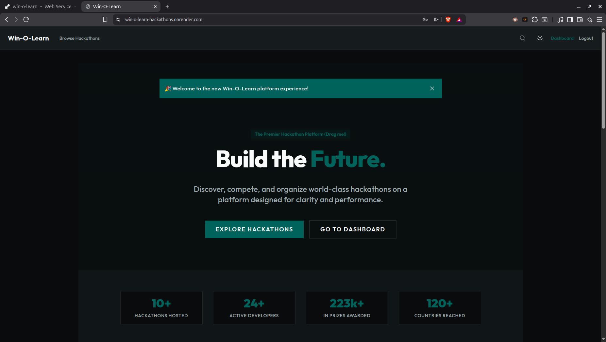

**Hackathons Listing Page**
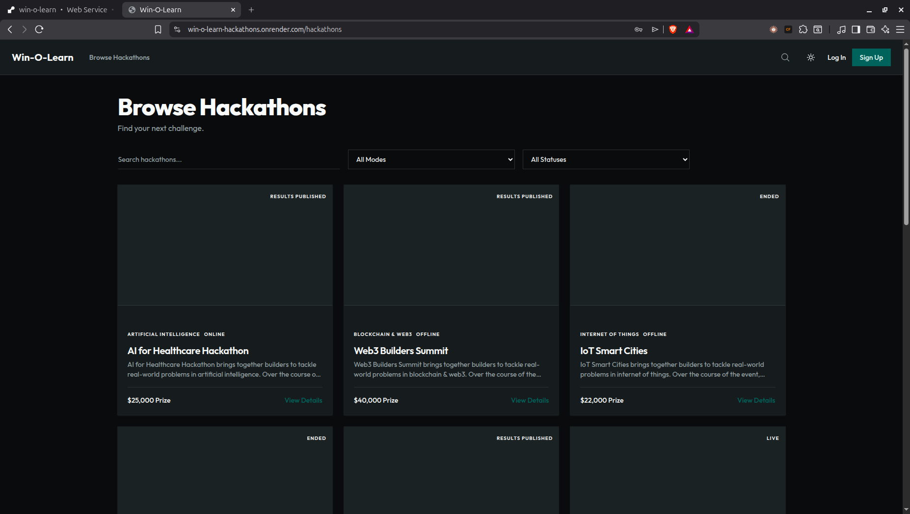

**Hackathon Details Page**
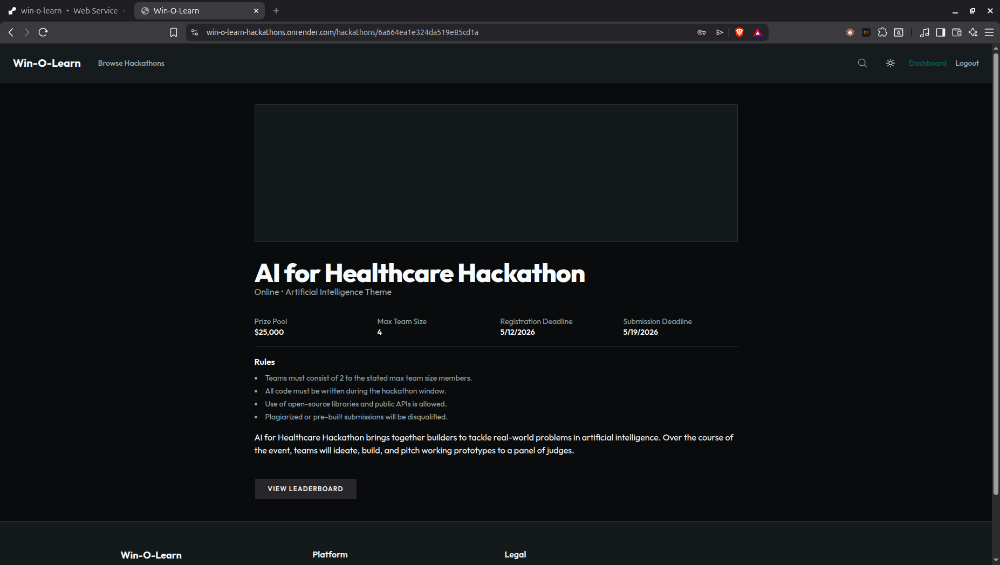

**Login / Registration Page**
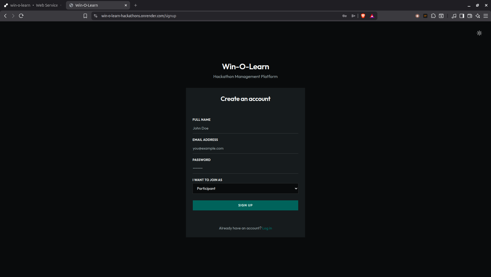

### Role-Based Dashboards

**Participant Dashboard**
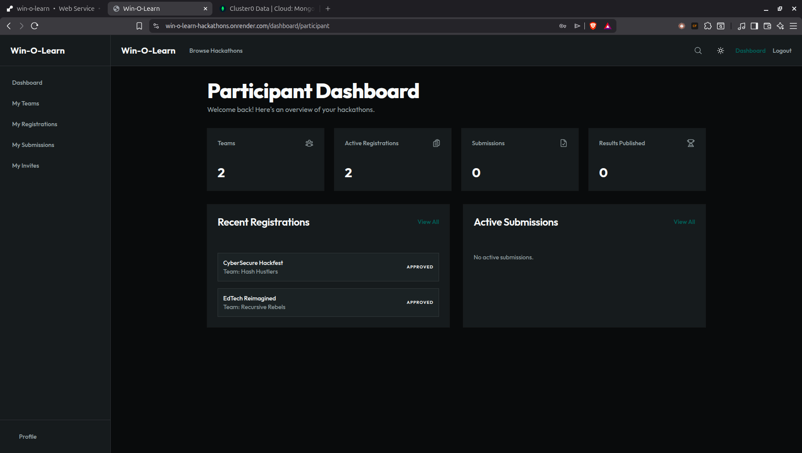

**Organizer Dashboard**
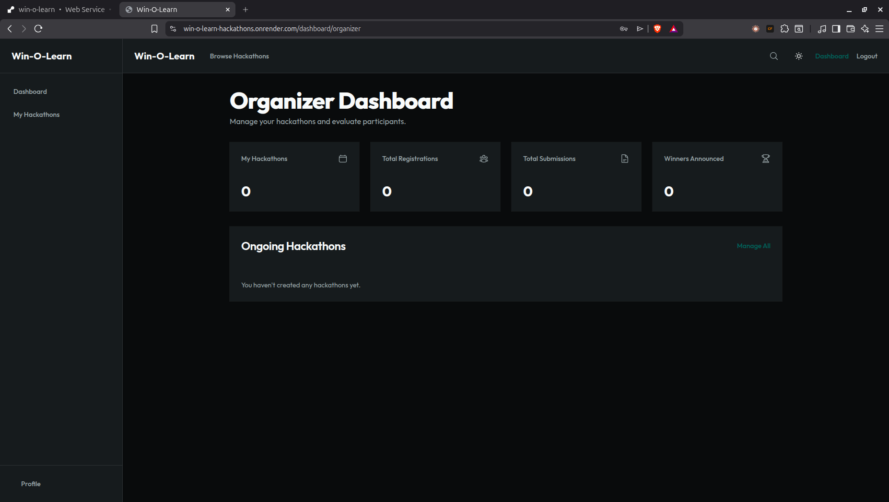

**Judge Dashboard**
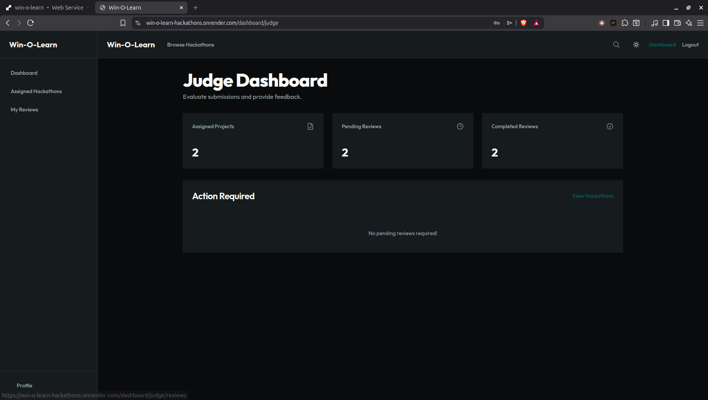

**Admin Dashboard**
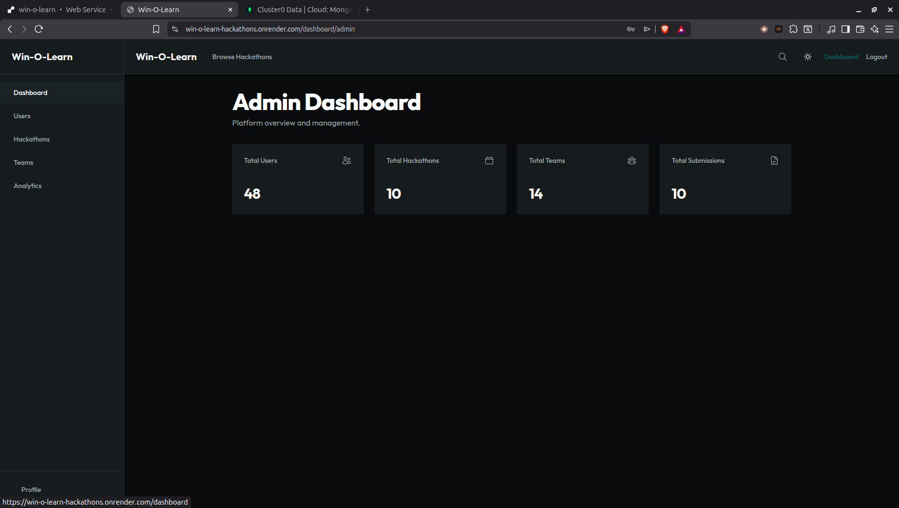

### Core Workflows

**Team Formation & Registration**
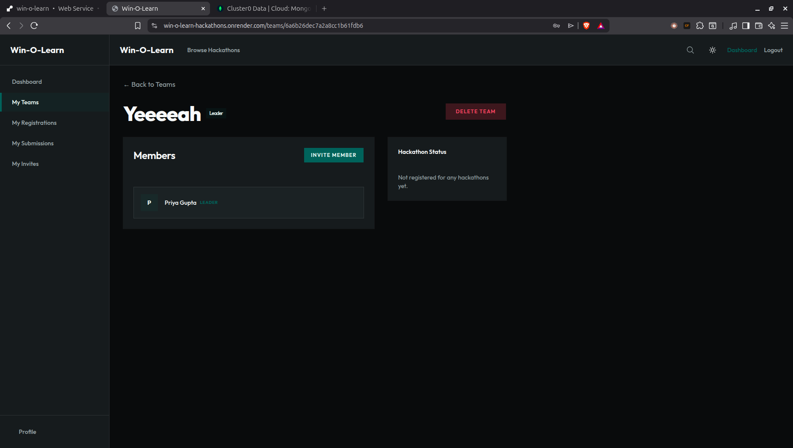

**Project Submission Interface**
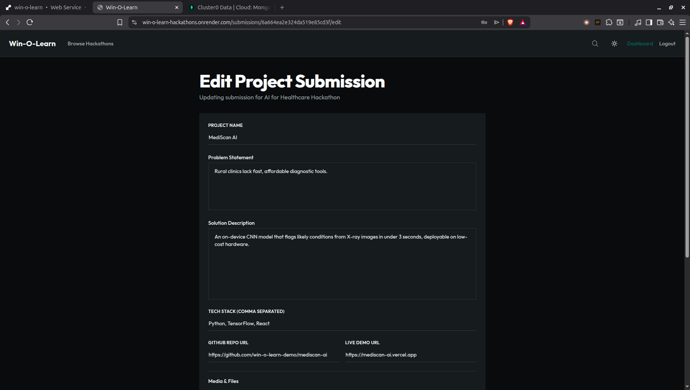

**Judging & Review Interface**
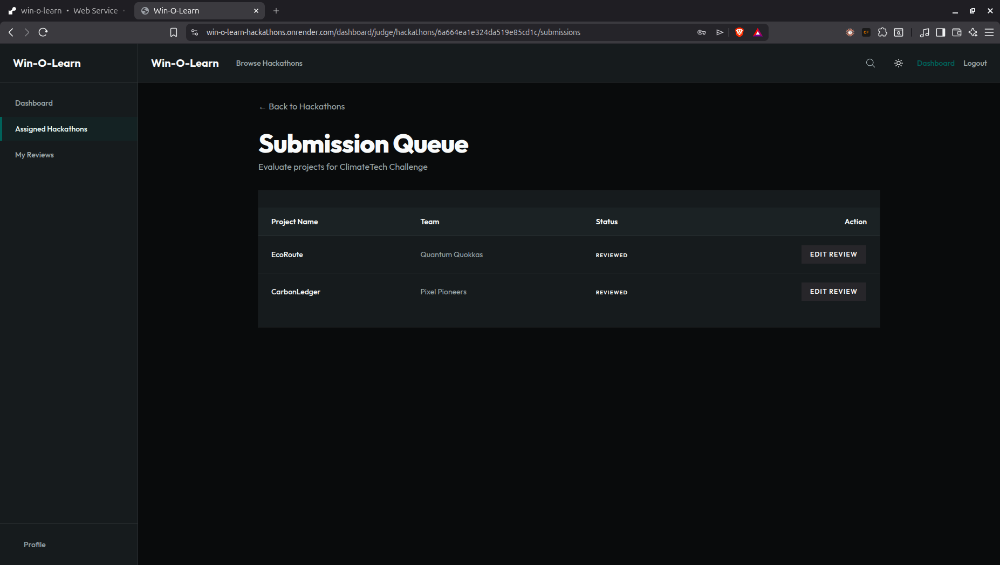
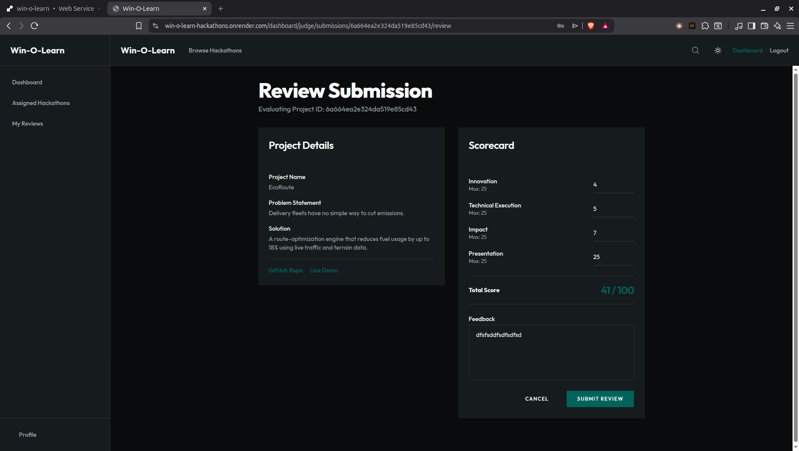

---

## 🚀 Running the Project Locally

### Prerequisites
- Node.js (v18+)
- MongoDB (Local or Atlas)
- Cloudinary Account (for file uploads)

### Backend Setup
1. Navigate to the `BACKEND` directory: `cd BACKEND`
2. Install dependencies: `npm install`
3. Create a `.env` file based on `.env.example` and fill in your MongoDB URI, JWT secret, and Cloudinary credentials.
4. Start the development server: `npm run dev`

### Frontend Setup
1. Navigate to the `FRONTEND` directory: `cd FRONTEND`
2. Install dependencies: `npm install`
3. Create a `.env` file based on `.env.example` and set your API base URL (`VITE_API_URL=http://localhost:3000`).
4. Start the development server: `npm run dev`

---
